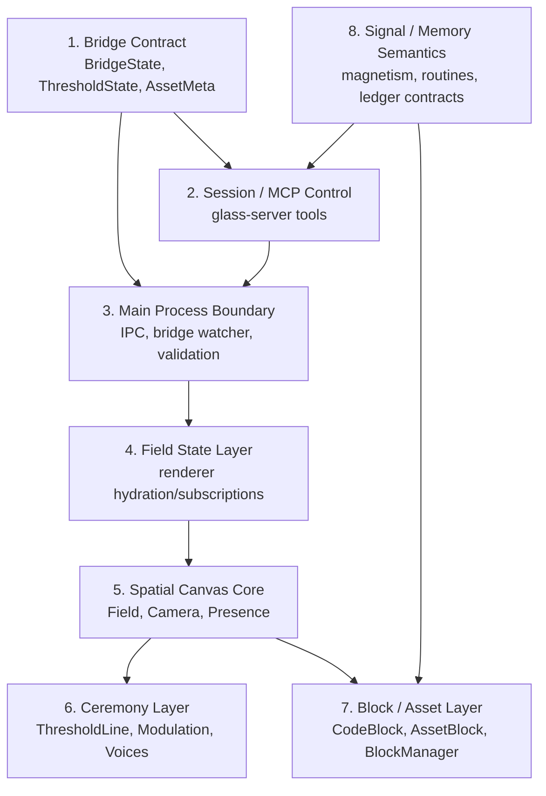
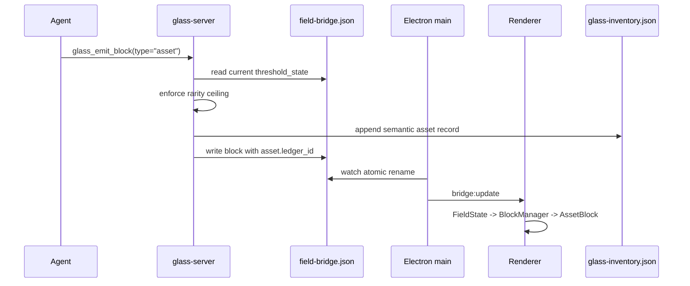
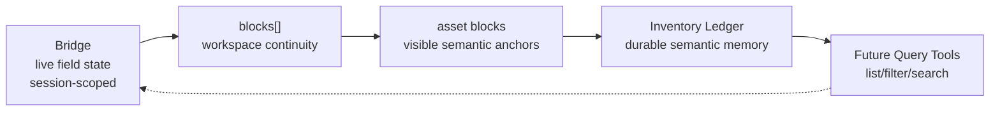

# Glass Architecture Partitions

This is the working map for moving Glass from a two-dimensional bridge/render loop into
a three-dimensional agent field with durable semantic assets.

## High-Level Partitions

## Runtime Data Flow

## Persistence Boundary

## Study Notes

- The bridge is still the visual truth for the renderer, but not the durable truth for semantic assets.
- Rarity is controlled at mint time by ceremony state, so the server must write the durable ledger only after passing the gate.
- `ledger_id` is the join key between field-visible `AssetMeta` and durable inventory records.
- The next backend step is therefore a small atomic JSON ledger, not a database migration yet.
