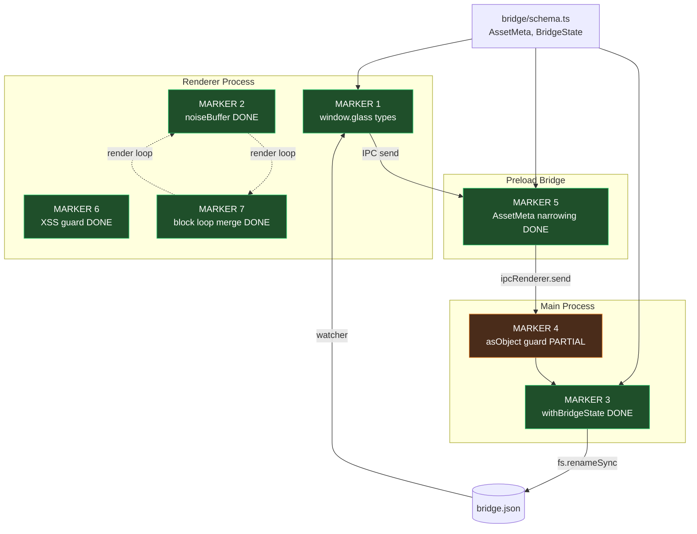

# Glass Refactoring Markers: Type Safety & Performance Optimizations

Seven refactor markers across three processes: **renderer** (browser), **main** (Node.js), and **preload** (bridge). This document is a current-state truth map: most markers are complete, and the only remaining consistency item is the `search:semantic` inline payload validation path.

## Process Topology

```
+-----------------------------------------------------------+
|                     GLASS (Electron)                      |
+-----------------------------------------------------------+
|                                                           |
|   [Renderer]  <---IPC--->  [Preload]  <---IPC--->  [Main] |
|   browser                  contextBridge            node  |
|                                                           |
|   Markers:                 Markers:                 Markers: |
|   1 (window.glass) DONE    5 (AssetMeta) DONE       3 (atomic writes) DONE |
|   2 (noiseBuffer) DONE                              4 (asObject guard) PARTIAL |
|   6 (XSS guard) DONE                                                   |
|   7 (block loop merge) DONE                                            |
|                                                           |
+-----------------------------------------------------------+
```

Status: **DONE** = shipped · **PARTIAL** = source is mostly aligned with one documented consistency item · **DEFERRED/OPTIONAL** = future hardening, not required for current correctness.

---

## MARKER 1: `window.glass` Type Declaration & Usage

**Process:** Renderer · **Status:** DONE — production code uses the typed surface

`@/mnt/arch_data/home/caraxes/CascadeProjects/Applications/glass/src/renderer/index.ts:13` declares the typed `window.glass` API. Production renderer code uses that surface directly; the remaining `(window as any).glass` references are test-only mocks in `InventoryMenu.test.ts`. `CodeBlock.ts` keeps a local typed optional guard for `patchBlock`, not an `any` cast.

### Flow diagram

```
Global augmentation (renderer/index.ts:13)
        |
        v
  interface Window { glass: { ... } }
        |
   +----+-----------------------------+
   |                                  |
   v                                  v
[typed usage - GOOD]           [more typed usage - GOOD]
Field.ts:119                   NoteBlock.ts:183    -> deleteBlock
  window.glass                 CodeBlock.ts:141    -> deleteBlock
    .patchBlockPosition()      GlobalHeader.ts:186 -> triggerCeremony
                               InventoryMenu.ts:80 -> listAssets

Test-only mocks:
InventoryMenu.test.ts          (window as any).glass
```

### Locations

- **1a** — Global augmentation: `@/mnt/arch_data/home/caraxes/CascadeProjects/Applications/glass/src/renderer/index.ts:13`
- **1b** — Typed surface (all methods): `@/mnt/arch_data/home/caraxes/CascadeProjects/Applications/glass/src/renderer/index.ts:15`
- **1c** — Correct usage example: `@/mnt/arch_data/home/caraxes/CascadeProjects/Applications/glass/src/renderer/field/Field.ts:119`
- **1d** — Typed delete usage: `@/mnt/arch_data/home/caraxes/CascadeProjects/Applications/glass/src/renderer/blocks/NoteBlock.ts:183`
- **1e** — Typed delete usage: `@/mnt/arch_data/home/caraxes/CascadeProjects/Applications/glass/src/renderer/blocks/CodeBlock.ts:141`
- **1f** — Typed ceremony usage: `@/mnt/arch_data/home/caraxes/CascadeProjects/Applications/glass/src/renderer/blocks/GlobalHeader.ts:186`
- **1g** — Typed asset-list usage: `@/mnt/arch_data/home/caraxes/CascadeProjects/Applications/glass/src/renderer/blocks/InventoryMenu.ts:80`

**Current note:** production `any` casts are gone. Test mocks still use `(window as any).glass` where Vitest stubs the preload API.

---

## MARKER 2: `drawGrain` Noise Buffer Optimization — **DONE**

**Process:** Renderer · **Status:** shipped

The old grain loop called `Math.random()` 300–500 times per frame. Now a 2048-slot `Float32Array` is filled once in the constructor. A wrapping cursor reads from it each frame.

### Render loop diagram

```
Field constructor                    render(dt)  [called every frame]
+------------------+                 +------------------------------+
| noiseBuffer      |                 | modEngine.tick()             |
| = Float32Array   |                 | camera.tick(dt)              |
|   (2048)         |                 | blockManager.tick(dt)        |
|                  |                 | drawGrain(intensity)         |
| for i..2048:     |---(fills)-----> |   fillStyle = "#ffffff"      |
|   buffer[i] =    |                 |   for i..count:              |
|     Math.random()|                 |     fillRect(                |
+------------------+                 |       buffer[cursor++ & 2047]|
                                     |       * canvas.width, ...)   |
                                     +------------------------------+
```

### Locations

- **2a** — Buffer field: `@/mnt/arch_data/home/caraxes/CascadeProjects/Applications/glass/src/renderer/field/Field.ts:59`
- **2b** — One-time fill: `@/mnt/arch_data/home/caraxes/CascadeProjects/Applications/glass/src/renderer/field/Field.ts:135`
- **2c** — Hoisted `fillStyle`: `@/mnt/arch_data/home/caraxes/CascadeProjects/Applications/glass/src/renderer/field/Field.ts:400`
- **2d** — Buffer consumption: `@/mnt/arch_data/home/caraxes/CascadeProjects/Applications/glass/src/renderer/field/Field.ts:403`
- **2e** — `drawGrain` invocation: `@/mnt/arch_data/home/caraxes/CascadeProjects/Applications/glass/src/renderer/field/Field.ts:376`

---

## MARKER 3: `withBridgeState` Atomic Write Helper

**Process:** Main · **Status:** DONE

The helper wraps the `read → mutate → tmp-write → rename` pattern with `0o600` perms. `setBridgeThresholdState` now routes through `withBridgeState("ceremony", ...)`, matching the other bridge mutation helpers.

### Atomic write pattern

```
              withBridgeState(tag, mutate)
                       |
                       v
              +--------+--------+
              | readBridgeFile  |
              +--------+--------+
                       |
                       v
              +--------+--------+
              | mutate(state)   |  <- callback; returns bool
              +--------+--------+
                       |
                       v
              +--------+--------+
              | write tmp file  |  BRIDGE_PATH.tmp.<pid>.<tag>
              | mode 0o600      |
              +--------+--------+
                       |
                       v
              +--------+--------+
              | renameSync()    |  atomic swap
              +-----------------+

Migrated: msg, add, pos, edit, del, ceremony
Pending:  none
```

### Locations

- **3a** — Helper: `@/mnt/arch_data/home/caraxes/CascadeProjects/Applications/glass/src/main/bridge-watcher.ts:240`
- **3b** — Tmp file pattern: `@/mnt/arch_data/home/caraxes/CascadeProjects/Applications/glass/src/main/bridge-watcher.ts:243`
- **3c** — `appendConversationTurn`: `@/mnt/arch_data/home/caraxes/CascadeProjects/Applications/glass/src/main/bridge-watcher.ts:256`
- **3d** — `addBridgeBlock`: `@/mnt/arch_data/home/caraxes/CascadeProjects/Applications/glass/src/main/bridge-watcher.ts:292`
- **3e** — `patchBridgeBlockPosition`: `@/mnt/arch_data/home/caraxes/CascadeProjects/Applications/glass/src/main/bridge-watcher.ts:335`
- **3f** — `patchBridgeBlock`: `@/mnt/arch_data/home/caraxes/CascadeProjects/Applications/glass/src/main/bridge-watcher.ts:377`
- **3g** — `deleteBridgeBlock`: `@/mnt/arch_data/home/caraxes/CascadeProjects/Applications/glass/src/main/bridge-watcher.ts:415`
- **3h** — `setBridgeThresholdState` via helper: `@/mnt/arch_data/home/caraxes/CascadeProjects/Applications/glass/src/main/bridge-watcher.ts:445`

---

## MARKER 4: IPC Payload Validation Guard

**Process:** Main · **Status:** PARTIAL — `ipcMain.on` routes use `asObject`; `search:semantic` still validates inline

Payload-bearing IPC handlers check incoming payloads. The `asObject(payload, channel)` helper holds the shared `typeof/null` check, and all current `ipcMain.on` routes use it. The remaining consistency item is `ipcMain.handle("search:semantic")`, which performs equivalent inline object checks for `query` and `limit` instead of calling `asObject`.

### IPC surface

```
Renderer  ---[ipcRenderer.send/invoke]--->  Main
                                              |
                                              v
                                      +-------+--------+
                                      | asObject guard |
                                      +-------+--------+
                                              |
            +---------------+-----------------+-----------------+----------------+
            |               |                 |                 |                |
            v               v                 v                 v                v
        patch-block   send-message       add-block      patch-block-position delete-block
            |               |                 |                 |                |
            +-------+-------+                 +--------+--------+                |
                    |                                  |                         |
                    v                                  v                         v
             trigger-ceremony                 search:semantic              (deleteBridgeBlock)
             uses asObject                    inline validation remains
```

### Locations

- **4a** — `bridge:patch-block`: `@/mnt/arch_data/home/caraxes/CascadeProjects/Applications/glass/src/main/index.ts:110`
- **4b** — Repeated validation pattern: `@/mnt/arch_data/home/caraxes/CascadeProjects/Applications/glass/src/main/index.ts:111`
- **4c** — `bridge:send-message`: `@/mnt/arch_data/home/caraxes/CascadeProjects/Applications/glass/src/main/index.ts:125`
- **4d** — `bridge:add-block`: `@/mnt/arch_data/home/caraxes/CascadeProjects/Applications/glass/src/main/index.ts:138`
- **4e** — `bridge:patch-block-position`: `@/mnt/arch_data/home/caraxes/CascadeProjects/Applications/glass/src/main/index.ts:164`
- **4f** — `bridge:delete-block`: `@/mnt/arch_data/home/caraxes/CascadeProjects/Applications/glass/src/main/index.ts:177`
- **4g** — `bridge:trigger-ceremony`: `@/mnt/arch_data/home/caraxes/CascadeProjects/Applications/glass/src/main/index.ts:216`
- **4h** — Remaining consistency item, `search:semantic` inline checks: `@/mnt/arch_data/home/caraxes/CascadeProjects/Applications/glass/src/main/index.ts:191`

---

## MARKER 5: `AssetMeta` Type Narrowing in Preload Bridge

**Process:** Preload · **Status:** DONE — preload uses `AssetMeta`

`AssetMeta` lives in `bridge/schema.ts`. The renderer and preload layers both use it for `window.glass.addBlock`, and the main bridge-watcher still validates asset metadata and ceremony rarity before accepting an asset block.

### Type flow

```
bridge/schema.ts                  preload/index.ts             renderer/index.ts
+------------------+              +------------------+         +--------------------+
| interface        |--- import -->| asset?: AssetMeta|<--------| asset?: AssetMeta  |
|   AssetMeta      |              |   [ALIGNED]      |         |   (via window.glass)|
+------------------+              +--------+---------+         +--------------------+
                                           |
                                           v ipcRenderer.send
                                  +------------------+
                                  | main/index.ts    |
                                  | ipcMain.on(      |
                                  |  "bridge:add-    |
                                  |   block")        |
                                  +--------+---------+
                                           |
                                           v
                                  +------------------+
                                  | bridge-watcher   |
                                  | validateAssetMeta|
                                  +------------------+
```

### Locations

- **5a** — `AssetMeta` definition: `@/mnt/arch_data/home/caraxes/CascadeProjects/Applications/glass/bridge/schema.ts:214`
- **5b** — Preload import: `@/mnt/arch_data/home/caraxes/CascadeProjects/Applications/glass/src/preload/index.ts:2`
- **5c** — Preload narrowed `asset?: AssetMeta`: `@/mnt/arch_data/home/caraxes/CascadeProjects/Applications/glass/src/preload/index.ts:20`
- **5d** — Renderer contract: `@/mnt/arch_data/home/caraxes/CascadeProjects/Applications/glass/src/renderer/index.ts:24`
- **5e** — Runtime validator: `@/mnt/arch_data/home/caraxes/CascadeProjects/Applications/glass/src/main/bridge-watcher.ts:64`

**Current note:** compile-time typing is aligned at preload/renderer; runtime acceptance still depends on `validateAssetMeta`.

---

## MARKER 6: NoteBlock Markdown XSS Sanitization — **DONE**

**Process:** Renderer · **Status:** shipped — script-tag filter runs before `innerHTML`

`NoteBlock.renderMarkdown()` turns user content into HTML and writes it via `innerHTML`. A `<script>` strip now runs first as a safety net. A later pass may swap in DOMPurify.

### Rendering pipeline

```
setContent(content)
        |
        v
renderMarkdown()
        |
        v
+---------------------+
| escape & < >        |
+---------+-----------+
          |
          v
+---------------------+
| headings / bold /   |
| code / blockquote   |
+---------+-----------+
          |
          v
+---------------------+
| paragraph + list    |
| wrapping            |
+---------+-----------+
          |
          v
+---------------------+
| strip <script>...   |  <- XSS guard
+---------+-----------+
          |
          v
  contentElement.innerHTML = safe
```

### Locations

- **6a** — `renderMarkdown` entry: `@/mnt/arch_data/home/caraxes/CascadeProjects/Applications/glass/src/renderer/blocks/NoteBlock.ts:253`
- **6b** — Paragraph / list processing: `@/mnt/arch_data/home/caraxes/CascadeProjects/Applications/glass/src/renderer/blocks/NoteBlock.ts:271`
- **6c** — `innerHTML` assignment with script filter: `@/mnt/arch_data/home/caraxes/CascadeProjects/Applications/glass/src/renderer/blocks/NoteBlock.ts:287`
- **6d** — `setContent` trigger: `@/mnt/arch_data/home/caraxes/CascadeProjects/Applications/glass/src/renderer/blocks/NoteBlock.ts:96`

---

## MARKER 7: Block Opacity & ColorTemp Loop Merge — **DONE**

**Process:** Renderer · **Status:** shipped

The render loop used to walk `blockManager.getAll()` twice — once for opacity, once for color temperature. Both now run in one pass: `updateBlocks(levitationMod, state)`.

### Before vs after

```
  BEFORE (two passes)                AFTER (one pass)
  +----------------------+           +----------------------+
  | updateBlockOpacities |           | updateBlocks(        |
  |   for b of getAll()  |           |   levMod, state)     |
  |     cb.updateOpacity |           |   for b of getAll()  |
  +----------+-----------+           |     cb.updateOpacity |
             |                       |     cb.setThreshold  |
             v                       |                State |
  +----------------------+           +----------------------+
  | updateBlockColorTemp |
  |   for b of getAll()  |
  |     cb.setThreshold  |
  +----------------------+
```

### Locations

- **7a** — Single call site: `@/mnt/arch_data/home/caraxes/CascadeProjects/Applications/glass/src/renderer/field/Field.ts:367`
- **7b** — Merged method: `@/mnt/arch_data/home/caraxes/CascadeProjects/Applications/glass/src/renderer/field/Field.ts:499`
- **7c** — Single iteration: `@/mnt/arch_data/home/caraxes/CascadeProjects/Applications/glass/src/renderer/field/Field.ts:500`
- **7d** — Opacity op: `@/mnt/arch_data/home/caraxes/CascadeProjects/Applications/glass/src/renderer/field/Field.ts:502`
- **7e** — Threshold state op: `@/mnt/arch_data/home/caraxes/CascadeProjects/Applications/glass/src/renderer/field/Field.ts:503`

---

## Summary table

| #   | Marker                              | Process  | Status  | Work remaining                                     |
| --- | ----------------------------------- | -------- | ------- | -------------------------------------------------- |
| 1   | `window.glass` type declaration     | renderer | DONE    | test-only mock casts remain                        |
| 2   | `drawGrain` noise buffer            | renderer | DONE    | —                                                  |
| 3   | `withBridgeState` atomic writes     | main     | DONE    | —                                                  |
| 4   | IPC payload validation (`asObject`) | main     | PARTIAL | optionally migrate `search:semantic` inline checks |
| 5   | `AssetMeta` narrowing in preload    | preload  | DONE    | —                                                  |
| 6   | NoteBlock markdown XSS guard        | renderer | DONE    | optional: adopt DOMPurify                          |
| 7   | Block opacity / colorTemp merge     | renderer | DONE    | —                                                  |

---

## Codemap — Mermaid



---

## Codemap — ASCII overview

```
================================================================================
  GLASS REFACTORING MARKERS — WHOLE-DOCUMENT OVERVIEW
================================================================================

  bridge/schema.ts  (shared types: AssetMeta, BridgeState, FieldProfile, ...)
        |
        +----------------+----------------+
        |                |                |
        v                v                v
   [RENDERER]        [PRELOAD]         [MAIN]
   browser ctx       contextBridge     node ctx
   ---------------   ---------------   ---------------
   M1 window.glass   M5 AssetMeta      M3 withBridgeState
      types DONE        narrowing DONE    migrated DONE
   M2 noiseBuffer                      M4 asObject guard
      DONE                                PARTIAL
                                       writes -> bridge.json (atomic)
   M6 XSS guard
      DONE                             bridge.json watcher -> renderer
                                       -----------------------------------
   M7 block loop
      merge DONE

   render loop:                         IPC channels:
   +-------------------------+          - bridge:patch-block
   | modEngine.tick          |          - bridge:send-message
   | camera.tick             |          - bridge:add-block
   | blockManager.tick       |          - bridge:patch-block-position
   | updateBlocks  <-- M7    |          - bridge:delete-block
   | drawGrain    <-- M2     |          - bridge:trigger-ceremony
   | draw layers             |          - search:semantic (handle)
   +-------------------------+

--------------------------------------------------------------------------------
  STATUS LEGEND
--------------------------------------------------------------------------------
  [DONE] M1 window.glass production typing
         M2 noiseBuffer
         M3 withBridgeState atomic writes
         M5 AssetMeta narrowing
         M6 XSS guard
         M7 block loop merge
  [PARTIAL] M4 asObject adoption: ipcMain.on routes aligned; search:semantic inline checks remain

--------------------------------------------------------------------------------
  DATA FLOW (end-to-end)
--------------------------------------------------------------------------------
  user action (click / drag / type)
        |
        v  window.glass.*        [M1 typed surface]
  renderer ----------------------> preload
                                    |
                                    v  ipcRenderer.send  [M5 typed payload]
                                   main
                                    |
                                    v  asObject(...)     [M4 guard]
                                   handler
                                    |
                                    v  withBridgeState   [M3 atomic write]
                                   bridge.json
                                    |
                                    v  fs.watch
                                   bridge-watcher -> onBridgeUpdate
                                    |
                                    v
                                   renderer state
                                    |
                                    v  render(dt)        [M2 grain, M7 blocks]
                                   canvas
================================================================================
```
