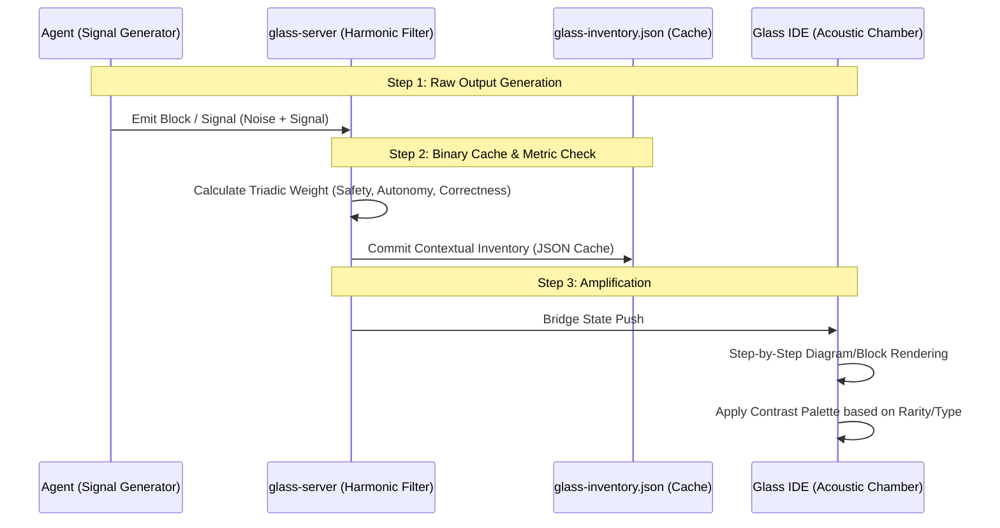

# System Harmonics & IDE Amplification

> **Objective:** Extend the user-agent interface into a unified spatial IDE. Convert raw diffs, agent states, and conversation logs into a "compressed raw signal of boostable acoustics"—where UI contrast, block density, and layout mathematically reflect the underlying operational truth.

This document serves as the high-level system instruction for rendering, evaluating, and amplifying the semantic inventory of the Glass environment.

---

## 1. Step-by-Step Contextual Inventory Rendering

To understand the difference between raw text and spatial meaning, we decompose the pipeline into discrete rendering steps. Every transition leaves a calculated "remainder of difference" (the diff), which is amplified visually.

### Contextual Inventory Cache

By caching text stats and metric metadata inside the inventory (`glass-inventory.json`), the IDE avoids recalculating historical weight. This cached semantic weight defines the block's "acoustic footprint" (size, opacity, Z-index) on the spatial canvas.

---

## 2. Palette Contrast & Acoustic Harmonics

Visual hierarchy in Glass is not decorative; it is a mathematical contrast scheme. By calculating the luminance and contrast against the Void (`#0a0a0c`), we map specific colors to specific cognitive frequencies.

| Frequency (Role)         | Hex Value | WCAG Luma | Target Contrast | Meaning in IDE / Diff                                         |
| :----------------------- | :-------- | :-------- | :-------------- | :------------------------------------------------------------ |
| **Void** (Background)    | `#0a0a0c` | ~0.01     | 1.00 : 1        | Silence. The canvas ground.                                   |
| **Surface** (Block BG)   | `#14141a` | ~0.02     | ~1.30 : 1       | Sub-bass. Low noise structure holding data.                   |
| **Amber** (Velocity)     | `#e8c9a0` | ~0.60     | ~14.0 : 1       | High frequency. Active agent generation / Diff additions.     |
| **Silver** (Guard)       | `#8892b0` | ~0.28     | ~7.50 : 1       | Mid frequency. Contextual scaffolding / Unchanged diff lines. |
| **Gold** (Lens)          | `#c4956a` | ~0.35     | ~9.00 : 1       | Resonant frequency. Verified inventory / System instruction.  |
| **Mythic** (Error/Alert) | `#a0524a` | ~0.15     | ~4.50 : 1       | Dissonance. Test failures / Constraint violations.            |

**Application in Diff Evaluation:**
When evaluating a diff, the IDE applies these contrasts to the "remainder of difference."

- **Addition (+):** Boosted acoustic (Amber `#e8c9a0`)
- **Context ( ):** Muted acoustic (Silver `#8892b0`)
- **Deletion (-):** Dissonant acoustic (Mythic `#a0524a`)

---

## 3. Binary Style Calculation & Metric Check

To structurally "claw" at the environment, we map text statistics into binary mechanical limits:

1.  **Compression Ratio ($C_r$):** The ratio of raw text bytes to rendered semantic tokens. High compression indicates high signal.
2.  **Harmonic Resonance ($H_r$):** The average contrast ratio of active blocks on the screen. A high $H_r$ means the IDE is highly saturated with actionable differences.
3.  **Density ($D$):** `(Blocks * Bytes) / CanvasArea`.

### The Amplification Formula

$$ A*{boost} = \frac{C_r \times H_r}{D*{noise}} $$

If $A_{boost}$ exceeds the `_hot_threshold`, the IDE spatially reorganizes (e.g., snapping blocks to a grid, fading out Silver context, boosting Amber highlights).

---

## 4. Mechanical Surface (The Claw)

By unifying the IDE rendering with these hard contrast and caching metrics, the agent can systematically evaluate the frontend UI:

- Instead of reading arbitrary text, the agent requests the `glass_assets_list`.
- The agent calculates the _metric density_ of the current blocks.
- If the density is discordant, the agent "claws" the layout back to harmonics (e.g., removing old blocks, extracting invariants into the Worksheet).
