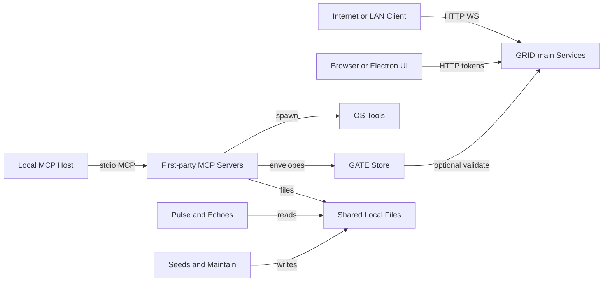

# CascadeProjects Threat Model

## Executive summary
- The workspace has two distinct risk planes: a potentially internet-exposed `GRID-main` FastAPI surface, and a set of local `stdio` MCP servers with broad filesystem, process-execution, and control-plane visibility. The highest-risk themes are: remote compromise of `GRID-main` auth/session or WebSocket surfaces when deployed beyond localhost, local misuse of privileged MCP tools that can modify files or run scripts as the operator, and integrity failure in the shared control-plane files (`GATE`, audit NDJSON, Seeds snapshots) that other tools trust for decisions and prioritization.

## Scope and assumptions
- In-scope paths:
  - Workspace root orchestration and shared control-plane artifacts: [README.md](/mnt/c/Users/USER/CascadeProjects/README.md), [docs/DATA_CONTRACTS.md](/mnt/c/Users/USER/CascadeProjects/docs/DATA_CONTRACTS.md), [scripts/gate](/mnt/c/Users/USER/CascadeProjects/scripts/gate), [GATE](/mnt/c/Users/USER/CascadeProjects/GATE)
  - First-party MCP servers: [afloat-server/src](/mnt/c/Users/USER/CascadeProjects/afloat-server/src), [echoes-server/src](/mnt/c/Users/USER/CascadeProjects/echoes-server/src), [grid-server/src](/mnt/c/Users/USER/CascadeProjects/grid-server/src), [lots-server/src](/mnt/c/Users/USER/CascadeProjects/lots-server/src), [maintain-server/src](/mnt/c/Users/USER/CascadeProjects/maintain-server/src), [pulse-server/src](/mnt/c/Users/USER/CascadeProjects/pulse-server/src), [seeds-server/src](/mnt/c/Users/USER/CascadeProjects/seeds-server/src)
  - `GRID-main` runtime paths: [GRID-main/src](/mnt/c/Users/USER/CascadeProjects/GRID-main/src), [GRID-main/arena_api](/mnt/c/Users/USER/CascadeProjects/GRID-main/arena_api), [GRID-main/frontend](/mnt/c/Users/USER/CascadeProjects/GRID-main/frontend), [GRID-main/railway.json](/mnt/c/Users/USER/CascadeProjects/GRID-main/railway.json)
- Out-of-scope for primary ranking:
  - `node_modules`, `dist`, `.venv`, generated artifacts, tests, examples, and docs unless they directly change runtime trust boundaries.
  - `mcp-tool-experiment/typescript-sdk` and `glimpse-artifact` are in the repo but are not primary risk drivers for the current workspace deployment model.
- Explicit assumptions validated with the user:
  - The whole workspace is in scope, but nested repos should be treated as separate components, not flattened into one application.
  - `GRID-main` should be treated as deployable beyond localhost or home LAN because it binds to `0.0.0.0` and includes a Railway deployment config ([GRID-main/railway.json](/mnt/c/Users/USER/CascadeProjects/GRID-main/railway.json#L7)).
  - First-party MCP servers in this repo are local `stdio` processes, not HTTP-exposed services, based on `server.connect(new StdioServerTransport())` entrypoints such as [echoes-server/src/server.ts](/mnt/c/Users/USER/CascadeProjects/echoes-server/src/server.ts#L339) and [maintain-server/src/server.ts](/mnt/c/Users/USER/CascadeProjects/maintain-server/src/server.ts#L1764).
  - Default operating context is a single-user developer workstation, not a multi-tenant SaaS deployment.
- Open questions that would materially change ranking:
  - Whether any `arena_api` side services besides Mothership are deployed on public networks today.
  - Whether `GATE` decisions are used for real deployment authorization or only local workflow hygiene.
  - Whether any local MCP host is bridged to remote clients outside this repository.

## System model
### Primary components
- `GRID-main` Mothership FastAPI app exposes REST, metrics, safety, corruption, DRT, auth, and imported subrouters; it wires auth dependencies, middleware, and exception handling in [GRID-main/src/application/mothership/main.py](/mnt/c/Users/USER/CascadeProjects/GRID-main/src/application/mothership/main.py#L576) and [GRID-main/src/application/mothership/dependencies.py](/mnt/c/Users/USER/CascadeProjects/GRID-main/src/application/mothership/dependencies.py#L189).
- `GRID-main` also includes additional network-facing services under [GRID-main/arena_api](/mnt/c/Users/USER/CascadeProjects/GRID-main/arena_api), including an API gateway and separate AI, arena, and discussion services with their own middleware and bind-all dev entrypoints.
- First-party MCP servers are local tool executors over `stdio`, for example [grid-server/src/server.ts](/mnt/c/Users/USER/CascadeProjects/grid-server/src/server.ts#L358), [lots-server/src/server.ts](/mnt/c/Users/USER/CascadeProjects/lots-server/src/server.ts#L898), and [maintain-server/src/server.ts](/mnt/c/Users/USER/CascadeProjects/maintain-server/src/server.ts#L1764).
- Shared local control-plane files connect servers outside the MCP transport itself: audit NDJSON, Seeds snapshots, workflow history, and `GATE` envelope/nonce/audit files as documented in [docs/DATA_CONTRACTS.md](/mnt/c/Users/USER/CascadeProjects/docs/DATA_CONTRACTS.md#L7).
- MCP servers also bridge into OS capabilities and developer tools: `lots-server` executes experiment scripts via `execFile`, `maintain-server` runs `git`, `npm`, `pip`, and `powershell`, and `seeds-server` runs git status and history commands ([lots-server/src/server.ts](/mnt/c/Users/USER/CascadeProjects/lots-server/src/server.ts#L264), [maintain-server/src/server.ts](/mnt/c/Users/USER/CascadeProjects/maintain-server/src/server.ts#L1443), [seeds-server/src/server.ts](/mnt/c/Users/USER/CascadeProjects/seeds-server/src/server.ts#L98)).

### Data flows and trust boundaries
- Internet or LAN client -> `GRID-main` Mothership API
  - Data types: credentials, JWTs, API keys, session IDs, request bodies, safety and telemetry events.
  - Channel: HTTP/HTTPS and FastAPI routing.
  - Security guarantees: JWT/API-key auth dependency, RBAC checks, security headers middleware, input sanitization and max-body enforcement via middleware stack ([GRID-main/src/application/mothership/dependencies.py](/mnt/c/Users/USER/CascadeProjects/GRID-main/src/application/mothership/dependencies.py#L189), [GRID-main/src/application/mothership/middleware/__init__.py](/mnt/c/Users/USER/CascadeProjects/GRID-main/src/application/mothership/middleware/__init__.py#L464)).
  - Validation/normalization: FastAPI request validation, exception handlers, middleware limits ([GRID-main/src/application/mothership/main.py](/mnt/c/Users/USER/CascadeProjects/GRID-main/src/application/mothership/main.py#L162), [GRID-main/src/application/mothership/middleware/__init__.py](/mnt/c/Users/USER/CascadeProjects/GRID-main/src/application/mothership/middleware/__init__.py#L514)).
- Browser or client app -> `GRID-main` WebSocket endpoints
  - Data types: session IDs, queries, streaming results, live feedback messages.
  - Channel: WebSocket.
  - Security guarantees: endpoint-specific only; the RAG WebSocket shown in repo accepts first and processes JSON messages without an auth dependency at the router boundary ([GRID-main/src/application/mothership/routers/rag_streaming.py](/mnt/c/Users/USER/CascadeProjects/GRID-main/src/application/mothership/routers/rag_streaming.py#L382)).
  - Validation/normalization: JSON parsing and per-message type checks are done in-handler; no repo-visible origin/auth gate is present in that endpoint.
- Local MCP host -> first-party MCP servers
  - Data types: tool names, JSON arguments, filesystem paths, workflow definitions, experiment IDs, operator notes.
  - Channel: MCP over `stdio`.
  - Security guarantees: local-process trust and per-tool Zod schemas; there is no repo-visible transport authentication because these entrypoints are not network listeners ([echoes-server/src/server.ts](/mnt/c/Users/USER/CascadeProjects/echoes-server/src/server.ts#L339), [lots-server/src/server.ts](/mnt/c/Users/USER/CascadeProjects/lots-server/src/server.ts#L904)).
  - Validation/normalization: tool schemas constrain shape and some ranges, but trust is largely delegated to the local host process and current user context.
- MCP servers -> shared local control-plane files
  - Data types: audit events, repo health snapshots, workflow definitions/executions, bookmarks, cleanup logs, `GATE` envelopes and nonce state.
  - Channel: local filesystem reads and writes.
  - Security guarantees: minimal; the data-contract doc explicitly states that Echoes audit writes are a local-first shortcut and are not mediated or validated by `echoes-server` ([docs/DATA_CONTRACTS.md](/mnt/c/Users/USER/CascadeProjects/docs/DATA_CONTRACTS.md#L15)).
  - Validation/normalization: JSON parsing and lightweight schema assumptions at read time; no signatures, file locking, or provenance enforcement are visible in the shared-file path.
- MCP servers -> OS tools and subprocesses
  - Data types: repo paths, cleanup targets, experiment script paths, process execution parameters.
  - Channel: local process execution (`execFile`) and direct filesystem mutation.
  - Security guarantees: targeted guardrails only. `lots-server` restricts scripts to `EXPERIMENTS_DIR`; `maintain-server` requires a dry-run preview token plus confirmation phrase; `afloat-server` currently simulates rather than spawns workflow commands ([lots-server/src/server.ts](/mnt/c/Users/USER/CascadeProjects/lots-server/src/server.ts#L312), [maintain-server/src/server.ts](/mnt/c/Users/USER/CascadeProjects/maintain-server/src/server.ts#L1518), [afloat-server/src/server.ts](/mnt/c/Users/USER/CascadeProjects/afloat-server/src/server.ts#L311)).
  - Validation/normalization: command choice is constrained in some places, but the user-context boundary remains the controlling privilege boundary.
- `grid-server` -> `GATE` store and optional `GRID-main` validation
  - Data types: envelope JSON, payload hashes, source and target partitions, permissions, test status.
  - Channel: local file reads plus optional HTTP POST to `/api/v1/gate/validate`.
  - Security guarantees: required-field checks, trusted-source list, payload hash integrity, timestamp freshness; optional remote validation is additive only and fails open with `approved: true` plus `grid_unavailable` ([grid-server/src/server.ts](/mnt/c/Users/USER/CascadeProjects/grid-server/src/server.ts#L65), [grid-server/src/server.ts](/mnt/c/Users/USER/CascadeProjects/grid-server/src/server.ts#L178)).
  - Validation/normalization: structural validation is implemented; repo-visible cryptographic validation of `user_fingerprint` or nonce burn enforcement is not.

#### Diagram

## Assets and security objectives
| Asset | Why it matters | Security objective (C/I/A) |
| --- | --- | --- |
| `GRID-main` auth tokens, API keys, refresh tokens | Token theft gives direct API access and session impersonation | C, I |
| Workspace source trees and git repos | They are the operator’s code, configs, and change history; destructive writes or cleanup affect daily work | I, A |
| Shared audit NDJSON and Seeds snapshots | They drive Pulse prioritization, health scoring, and operational trust | I, A |
| `GATE` envelopes, nonce registry, and deployment target permissions | These influence trust decisions around transitions and target permissions | I |
| Experiment scripts, workflow definitions, cleanup actions | They are the bridge from AI/tool calls into local process execution and file mutation | I, A |
| System metrics, journal, focus history, telemetry | They expose sensitive operational context about the machine and ongoing work | C |
| `GRID-main` RAG and WebSocket sessions | They can contain prompts, model outputs, session context, and live collaboration state | C, A |

## Attacker model
### Capabilities
- Remote attacker can probe `GRID-main` HTTP and WebSocket endpoints if deployed beyond localhost, including auth, metrics/docs in dev profiles, and imported routers ([GRID-main/src/application/mothership/main.py](/mnt/c/Users/USER/CascadeProjects/GRID-main/src/application/mothership/main.py#L615), [GRID-main/railway.json](/mnt/c/Users/USER/CascadeProjects/GRID-main/railway.json#L8)).
- Local attacker, compromised editor/plugin, or prompt-injected MCP host can invoke local `stdio` MCP tools with the same user privileges as the operator.
- Local attacker with filesystem write access can tamper with shared JSON/NDJSON control-plane files that other servers read and trust.
- Attacker can exploit deployment drift between `GRID-main` Mothership and the auxiliary `arena_api` services, because they are separate entrypoints and middleware stacks.

### Non-capabilities
- No repo evidence suggests the first-party MCP servers are directly reachable from the network in the default deployment; the attacker generally needs local process access to reach them.
- The default context is not multi-tenant SaaS; there is no strong repo evidence that cross-customer data isolation is currently the primary risk driver.
- The threat model does not assume admin or kernel-level host compromise by default; impacts are scored from remote network reachability or same-user local execution.

## Entry points and attack surfaces
| Surface | How reached | Trust boundary | Notes | Evidence (repo path / symbol) |
| --- | --- | --- | --- | --- |
| Mothership REST API | HTTP to `/api/v1`, `/health`, `/metrics`, `/api/v1/auth/*` | Network -> `GRID-main` | Main authenticated service surface | [GRID-main/src/application/mothership/main.py](/mnt/c/Users/USER/CascadeProjects/GRID-main/src/application/mothership/main.py#L847), [GRID-main/src/application/mothership/routers/auth.py](/mnt/c/Users/USER/CascadeProjects/GRID-main/src/application/mothership/routers/auth.py#L146) |
| Mothership auth dependencies | Authorization header or `X-API-Key` | Network -> auth/RBAC | Central auth path and dev-mode behavior | [GRID-main/src/application/mothership/dependencies.py](/mnt/c/Users/USER/CascadeProjects/GRID-main/src/application/mothership/dependencies.py#L140) |
| RAG WebSocket | WebSocket `/ws/{session_id}` under router prefix | Network -> WebSocket handler | Accepts connection and query messages in-handler | [GRID-main/src/application/mothership/routers/rag_streaming.py](/mnt/c/Users/USER/CascadeProjects/GRID-main/src/application/mothership/routers/rag_streaming.py#L382) |
| Auxiliary `arena_api` services | Direct FastAPI listeners on their own ports | Network -> service-specific middleware | Separate services widen attack surface and control drift risk | [GRID-main/arena_api/api_gateway/__init__.py](/mnt/c/Users/USER/CascadeProjects/GRID-main/arena_api/api_gateway/__init__.py#L58), [GRID-main/arena_api/services/ai_service/main.py](/mnt/c/Users/USER/CascadeProjects/GRID-main/arena_api/services/ai_service/main.py#L92) |
| Local MCP tool invocations | MCP host -> `stdio` server | Local host -> tool server | No transport auth; trust is by local process boundary | [grid-server/src/server.ts](/mnt/c/Users/USER/CascadeProjects/grid-server/src/server.ts#L358), [lots-server/src/server.ts](/mnt/c/Users/USER/CascadeProjects/lots-server/src/server.ts#L898) |
| Experiment execution | `lots-server` `experiment_run` | MCP tool -> OS process | Executes local scripts with Node/Python/PowerShell/Bash runners | [lots-server/src/server.ts](/mnt/c/Users/USER/CascadeProjects/lots-server/src/server.ts#L264) |
| Cleanup execution | `maintain-server` `cleanup_execute` | MCP tool -> filesystem / subprocess | Can purge caches, run git gc, and remove artifacts after preview token confirmation | [maintain-server/src/server.ts](/mnt/c/Users/USER/CascadeProjects/maintain-server/src/server.ts#L1443) |
| Shared audit log | Direct file append/read via contract | Local file writer -> consumers | Explicitly not mediated or validated centrally | [docs/DATA_CONTRACTS.md](/mnt/c/Users/USER/CascadeProjects/docs/DATA_CONTRACTS.md#L15), [echoes-server/src/server.ts](/mnt/c/Users/USER/CascadeProjects/echoes-server/src/server.ts#L60) |
| Seeds snapshots | `ecosystem_scan(saveSnapshot=true)` and Pulse readers | Local file writer -> consumers | Snapshot integrity directly affects prioritization logic | [seeds-server/src/server.ts](/mnt/c/Users/USER/CascadeProjects/seeds-server/src/server.ts#L323), [pulse-server/src/server.ts](/mnt/c/Users/USER/CascadeProjects/pulse-server/src/server.ts#L813) |
| GATE envelope validation | `grid-server` `validate_envelope` reading `incoming/*.json` | Local file -> policy decision | Structural validation plus optional additive HTTP validation | [grid-server/src/server.ts](/mnt/c/Users/USER/CascadeProjects/grid-server/src/server.ts#L178) |
| Browser token storage | Frontend local storage | Browser JS -> auth material | Stored bearer tokens raise XSS/token-theft blast radius | [GRID-main/frontend/src/api/client.ts](/mnt/c/Users/USER/CascadeProjects/GRID-main/frontend/src/api/client.ts#L168) |

## Top abuse paths
1. Attacker targets a deployed `GRID-main` browser client, steals tokens from browser storage, then calls protected APIs as the victim. Impact: account or operator-session compromise and unauthorized API actions.
2. Attacker opens or scripts WebSocket sessions against exposed `GRID-main` streaming endpoints, sends repeated query traffic, and ties up RAG or feedback loops. Impact: degraded availability and possible session confusion.
3. A compromised local MCP host invokes `lots-server` or `maintain-server`, using legitimate tool flows to run local scripts, purge caches, or mutate repos under the operator account. Impact: workstation integrity loss and work disruption.
4. A local process tampers with the shared Echoes audit NDJSON or Seeds snapshots, causing Pulse briefings and prioritization logic to trust false failures, hide real ones, or over/under-prioritize repos. Impact: control-plane integrity loss and operator misdirection.
5. An attacker with write access to `GATE/incoming` crafts an envelope that satisfies current structural checks or benefits from `grid_unavailable` fallback, influencing approval decisions without strong proof of origin. Impact: transition/deployment integrity compromise.
6. Deployment drift leaves some auxiliary `arena_api` services internet-reachable with weaker middleware or broad CORS than Mothership, letting attackers probe for the least-defended path. Impact: inconsistent auth posture, pre-auth reachability, and broader remote attack surface.
7. A compromised local client uses broad observability tools (`seeds-server`, `pulse-server`, `maintain-server`) to enumerate repos, system state, workflow history, and journaling metadata. Impact: confidentiality loss about code, operations, and current work.

## Threat model table
| Threat ID | Threat source | Prerequisites | Threat action | Impact | Impacted assets | Existing controls (evidence) | Gaps | Recommended mitigations | Detection ideas | Likelihood | Impact severity | Priority |
| --- | --- | --- | --- | --- | --- | --- | --- | --- | --- | --- | --- | --- |
| TM-001 | Remote attacker against deployed `GRID-main` client/API | `GRID-main` is reachable beyond localhost and the attacker can exploit browser script execution, token leakage, or a weak client surface | Steal bearer tokens from browser storage and replay them against auth-protected APIs | Unauthorized API use, session hijack, integrity loss in user actions | JWTs, refresh tokens, `GRID-main` session state | JWT auth and RBAC dependencies exist ([dependencies.py](/mnt/c/Users/USER/CascadeProjects/GRID-main/src/application/mothership/dependencies.py#L189)); auth endpoints are rate-limited and issue scoped tokens ([auth.py](/mnt/c/Users/USER/CascadeProjects/GRID-main/src/application/mothership/routers/auth.py#L146)) | Frontend stores tokens in `localStorage`, which raises XSS blast radius ([client.ts](/mnt/c/Users/USER/CascadeProjects/GRID-main/frontend/src/api/client.ts#L168)) | Move browser auth to `HttpOnly` cookies or BFF sessions; shorten token lifetime; add CSP and remove dangerous browser sinks; keep refresh-token storage off the JS-accessible path | Monitor auth refresh/login anomalies, replayed JWT use, and token use from new IPs or agents | medium | high | high |
| TM-002 | Remote attacker probing exposed HTTP/WebSocket services | One or more `GRID-main` or `arena_api` services are network-reachable | Abuse WebSocket or pre-auth API surfaces for high-cost queries, long-lived connections, or finding the weakest service configuration | Availability loss, possible info exposure, widened remote attack surface | `GRID-main` availability, session state, RAG compute, service reputation | Mothership wires security middleware, headers, and auth dependencies ([main.py](/mnt/c/Users/USER/CascadeProjects/GRID-main/src/application/mothership/main.py#L672), [middleware/__init__.py](/mnt/c/Users/USER/CascadeProjects/GRID-main/src/application/mothership/middleware/__init__.py#L490)) | The RAG WebSocket accepts immediately and handles messages in-handler ([rag_streaming.py](/mnt/c/Users/USER/CascadeProjects/GRID-main/src/application/mothership/routers/rag_streaming.py#L382)); auxiliary `arena_api` services widen configuration drift risk ([api_gateway/__init__.py](/mnt/c/Users/USER/CascadeProjects/GRID-main/arena_api/api_gateway/__init__.py#L58)) | Require explicit auth and per-session quotas on WebSocket routes; unify network exposure and middleware policy across Mothership and `arena_api`; add connection caps and per-route abuse budgets | Alert on connection count spikes, long-lived idle sessions, expensive query patterns, and per-service error/timeout bursts | medium | high | high |
| TM-003 | Local malicious MCP client, prompt injection, or compromised plugin/editor | Attacker can invoke local MCP tools in the operator context | Use `experiment_run` to execute scripts or `cleanup_execute` to remove artifacts and alter repos; stage workflows for later execution | Local code execution and destructive workstation changes as the operator | Source trees, caches, git history, experiments, workstation availability | `lots-server` restricts scripts to `EXPERIMENTS_DIR` ([lots-server/src/server.ts](/mnt/c/Users/USER/CascadeProjects/lots-server/src/server.ts#L312)); `maintain-server` requires dry-run preview token plus confirm phrase ([maintain-server/src/server.ts](/mnt/c/Users/USER/CascadeProjects/maintain-server/src/server.ts#L1518)); `afloat-server` currently simulates execution ([afloat-server/src/server.ts](/mnt/c/Users/USER/CascadeProjects/afloat-server/src/server.ts#L365)) | Trust is still coarse-grained at the local host boundary; experiments can run under user privileges; cleanup actions accept path overrides | Split high-risk tools behind an extra approval policy or separate MCP server; add per-tool allowlists for roots and interpreters; require signed or reviewed experiment definitions before execution | Alert on non-dry-run cleanup, experiment executions, unusual path targets, and sudden audit bursts from local MCP tools | high | high | high |
| TM-004 | Local process with write access to shared telemetry files | Attacker can write to audit NDJSON or snapshot directories | Poison audit or snapshot data so downstream tools trust false state | Misdirected operator decisions, hidden failures, bad prioritization | Audit logs, Seeds snapshots, Pulse briefings | Echoes normalizes and parses entries; Pulse correlates multiple signals ([echoes-server/src/server.ts](/mnt/c/Users/USER/CascadeProjects/echoes-server/src/server.ts#L75), [pulse-server/src/server.ts](/mnt/c/Users/USER/CascadeProjects/pulse-server/src/server.ts#L813)) | The contract explicitly says audit writes are not mediated or validated ([docs/DATA_CONTRACTS.md](/mnt/c/Users/USER/CascadeProjects/docs/DATA_CONTRACTS.md#L15)); snapshots are plain JSON files consumed by filename sort | Add append-only signatures or hash chaining across shared files; isolate writers; validate producer identity before consuming; record provenance in entries | Detect schema drift, impossible timestamps, source-name anomalies, and sudden score discontinuities in snapshots | medium | medium | high |
| TM-005 | Local attacker or process tampering with `GATE` inputs; degraded remote validator | Attacker can write `GATE` files or cause optional remote validation to fail | Forge or replay an envelope that passes structural checks, or rely on fallback approval when `GRID-main` is unavailable | Transition/deployment integrity compromise | `GATE` envelopes, nonce state, deployment permissions | `grid-server` checks required fields, trusted source, payload hash, timestamp freshness, and `tests_passed` ([grid-server/src/server.ts](/mnt/c/Users/USER/CascadeProjects/grid-server/src/server.ts#L178)); target permissions are separately modeled ([grid-server/src/server.ts](/mnt/c/Users/USER/CascadeProjects/grid-server/src/server.ts#L323)). **Implemented:** remote validation now fails closed (`approved: false`, `grid_unavailable`) when GRID is unreachable; nonce must be in registry and not burned, and is burned on successful validation; when `GATE_USER_SECRET` is set, `user_fingerprint` is verified via HMAC-SHA256 (same binding as `create_test_envelope.py`). | Optional: require `GATE_USER_SECRET` for production; remove test secrets from helper scripts | Make local validation authoritative on signed origin proof, nonce burn, and permission binding; fail closed for production targets when remote validation is required; remove test secrets from helper scripts | Alert on repeated envelope failures, reused nonces, `grid_unavailable` approvals, and source partitions outside normal operator patterns | medium | high | high |
| TM-006 | Local compromised MCP client or insider on the workstation | Attacker can call read-heavy local MCP tools | Enumerate repos, process state, journals, workflow history, and telemetry to map the operator’s current work and sensitive local context | Confidentiality loss and improved staging for later destructive actions | Repo inventory, focus/journal data, system metrics, workflow history | Default deployment is local `stdio` only ([echoes-server/src/server.ts](/mnt/c/Users/USER/CascadeProjects/echoes-server/src/server.ts#L339)); some tools are descriptive rather than mutating, and schemas constrain query size | No per-client auth segmentation or least-privilege scoping inside the local MCP plane; servers expose broad scan roots and operational detail | Partition read-only vs privileged MCP capabilities; reduce default scan roots; add redaction for process/journal details; tie sensitive tool access to explicit operator confirmation | Watch for bulk listing activity, repeated `scan_*`, `ecosystem_scan`, `morning_briefing`, and cross-server correlation requests from unusual sessions | medium | medium | medium |

## Criticality calibration
- `critical` in this workspace means a compromise that materially changes deployment or code integrity with limited additional prerequisites, or a remote path that yields authenticated control of `GRID-main`. Examples: forged `GATE` approvals for real deployment decisions; pre-auth remote compromise of a network-exposed auth/session path; arbitrary local code execution through a remotely bridged MCP host.
- `high` means a realistic attack that causes major integrity or availability damage under the single-user workstation model but still requires either remote reachability of `GRID-main` or local-tool invocation capability. Examples: token replay from browser storage; destructive `cleanup_execute` misuse; high-cost abuse of exposed WebSocket/RAG paths; audit/snapshot poisoning that misdirects operator action.
- `medium` means meaningful but more conditional confidentiality or integrity loss that generally requires a local foothold or deployment misconfiguration. Examples: workspace observability data harvesting; exposure of dev docs/metrics on an externally reachable instance; false-positive or false-negative prioritization from corrupted telemetry files.
- `low` means issues that are mostly noisy, easy to recover from, or require unlikely preconditions in the current single-user setup. Examples: stale snapshot files causing brief prioritization drift, low-sensitivity path disclosure from health endpoints, or local read-only inventory without a path to execution.

## Focus paths for security review
| Path | Why it matters | Related Threat IDs |
| --- | --- | --- |
| [GRID-main/src/application/mothership/main.py](/mnt/c/Users/USER/CascadeProjects/GRID-main/src/application/mothership/main.py) | Main network entrypoint, middleware wiring, router inclusion, metrics/docs exposure | TM-001, TM-002 |
| [GRID-main/src/application/mothership/dependencies.py](/mnt/c/Users/USER/CascadeProjects/GRID-main/src/application/mothership/dependencies.py) | Central JWT/API-key auth, RBAC, dev-bypass behavior | TM-001, TM-002 |
| [GRID-main/src/application/mothership/middleware/__init__.py](/mnt/c/Users/USER/CascadeProjects/GRID-main/src/application/mothership/middleware/__init__.py) | Security headers, rate limiting, security enforcer, request controls | TM-001, TM-002 |
| [GRID-main/src/application/mothership/routers/auth.py](/mnt/c/Users/USER/CascadeProjects/GRID-main/src/application/mothership/routers/auth.py) | Login, refresh, token validation and revocation flows | TM-001 |
| [GRID-main/src/application/mothership/routers/rag_streaming.py](/mnt/c/Users/USER/CascadeProjects/GRID-main/src/application/mothership/routers/rag_streaming.py) | WebSocket query surface and session handling | TM-002 |
| [GRID-main/frontend/src/api/client.ts](/mnt/c/Users/USER/CascadeProjects/GRID-main/frontend/src/api/client.ts) | Browser token storage and API client behavior | TM-001 |
| [GRID-main/arena_api/api_gateway/__init__.py](/mnt/c/Users/USER/CascadeProjects/GRID-main/arena_api/api_gateway/__init__.py) | Separate gateway surface with its own CORS/docs/host policy | TM-002 |
| [GRID-main/arena_api/services/ai_service/main.py](/mnt/c/Users/USER/CascadeProjects/GRID-main/arena_api/services/ai_service/main.py) | Additional bind-all service surface and middleware drift risk | TM-002 |
| [GRID-main/arena_api/services/arena_service/main.py](/mnt/c/Users/USER/CascadeProjects/GRID-main/arena_api/services/arena_service/main.py) | Additional bind-all service surface and middleware drift risk | TM-002 |
| [GRID-main/arena_api/services/discussion_service/main.py](/mnt/c/Users/USER/CascadeProjects/GRID-main/arena_api/services/discussion_service/main.py) | Additional bind-all service surface and middleware drift risk | TM-002 |
| [lots-server/src/server.ts](/mnt/c/Users/USER/CascadeProjects/lots-server/src/server.ts) | Experiment creation and script execution boundary | TM-003 |
| [maintain-server/src/server.ts](/mnt/c/Users/USER/CascadeProjects/maintain-server/src/server.ts) | Destructive cleanup boundary, path handling, subprocess use | TM-003, TM-006 |
| [afloat-server/src/server.ts](/mnt/c/Users/USER/CascadeProjects/afloat-server/src/server.ts) | Workflow definitions store commands and could become an execution bridge later | TM-003 |
| [echoes-server/src/server.ts](/mnt/c/Users/USER/CascadeProjects/echoes-server/src/server.ts) | Audit persistence and query boundary | TM-004, TM-006 |
| [pulse-server/src/server.ts](/mnt/c/Users/USER/CascadeProjects/pulse-server/src/server.ts) | Consumes audit/snapshot state for decision support | TM-004, TM-006 |
| [seeds-server/src/server.ts](/mnt/c/Users/USER/CascadeProjects/seeds-server/src/server.ts) | Snapshot production, repo inventory, subprocess-based repo probing | TM-004, TM-006 |
| [grid-server/src/server.ts](/mnt/c/Users/USER/CascadeProjects/grid-server/src/server.ts) | `GATE` validation logic, permission model, fail-open behavior | TM-005 |
| [scripts/gate/create_test_envelope.py](/mnt/c/Users/USER/CascadeProjects/scripts/gate/create_test_envelope.py) | Helper script shaping operator expectations around envelope creation and secret handling | TM-005 |
| [scripts/gate/debug_fingerprint.py](/mnt/c/Users/USER/CascadeProjects/scripts/gate/debug_fingerprint.py) | Reveals weak secret-handling patterns around envelope verification | TM-005 |
| [docs/DATA_CONTRACTS.md](/mnt/c/Users/USER/CascadeProjects/docs/DATA_CONTRACTS.md) | Authoritative statement of shared-file trust assumptions and non-mediated audit flow | TM-004, TM-006 |

## Quality check
- All primary runtime entry points covered: `GRID-main` HTTP/WebSocket, first-party MCP `stdio` tools, shared file contracts, and `GATE`.
- Each major trust boundary represented in at least one threat: network API, WebSocket, local MCP, shared files, `GATE`, and subprocess/file-mutation boundaries.
- Runtime vs CI/dev separation maintained: build/test artifacts and upstream SDK/test fixtures were excluded from the primary risk ranking.
- User clarifications reflected: whole-workspace scope, `GRID-main` treated as possibly internet-exposed, first-party MCP treated as local `stdio`, single-user workstation as default.
- Remaining conditional assumptions are explicit: public exposure of auxiliary `arena_api` services, production use of `GATE`, and any remote bridge into the local MCP plane.
