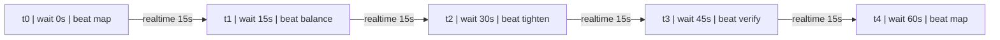

# Airflow Visual Reference: Direct Interval Transport

This artifact shows how interval-based references are transported in real time through a simple node-edge graph.

## Basic Data Graph Structure

```json
{
  "nodes": [
    {
      "id": "t0",
      "wait_time_s": 0,
      "wait_bucket": 0,
      "fan_speed": 850,
      "temperature": 24.0,
      "category": "Smooth Flow",
      "mode": "Rhythm",
      "pass_count": "1",
      "beat_phase": "map",
      "lesson": "LVL shared | TYPE varied | Smooth Flow | Beat:map | Wait:0"
    }
  ],
  "edges": [
    {
      "from": "t0",
      "to": "t1",
      "transport": "realtime",
      "channel": "interval_stream",
      "delta_wait_s": 15
    }
  ],
  "legend": {
    "x_axis": "wait_time_seconds",
    "y_axes": ["fan_speed_rpm", "temperature_c"],
    "transport_model": "sequential_interval_stream"
  }
}
```

## Transport Flow (Mermaid)



## ASCII Visual Reference

```text
Reference Graph (Realtime Interval Transport)
X=wait(s) | Y1=fan RPM | Y2=temp C
t0 @ 0s | RPM 850 # | TEMP 24.0 * | Smooth Flow | Beat:map
t1 @ 15s | RPM 875 ##### | TEMP 25.0 ***** | Smooth Flow | Beat:balance
t2 @ 30s | RPM 900 ########## | TEMP 26.0 ********** | Smooth Flow | Beat:tighten
t3 @ 45s | RPM 925 ############### | TEMP 27.0 *************** | Smooth Flow | Beat:verify
t4 @ 60s | RPM 950 #################### | TEMP 28.0 ******************** | Smooth Flow | Beat:map
Transport Lane: t0->t1 -> t1->t2 -> t2->t3 -> t3->t4
```

## Runtime Usage

```python
from airflow import build_realtime_reference_graph, visual_reference

graph = build_realtime_reference_graph(intervals_s=(0, 15, 30, 45, 60))
print(graph)
print(visual_reference(intervals_s=(0, 15, 30, 45, 60)))
```
