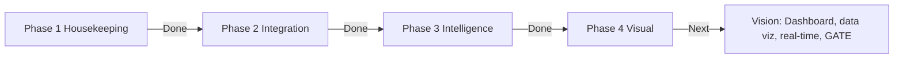

# Docs

Root-level documentation for the CascadeProjects workspace.

## Directory and attention map

| Document | Description |
|----------|-------------|
| [STRUCTURE.md](STRUCTURE.md) | **Workspace structure and attention map** — Where things live, who owns what, where to look first. Start here for navigation and agency. |

## Core docs

| Document | Description |
|----------|-------------|
| [progress-and-vision.html](progress-and-vision.html) | **Progress and vision** — Single-page visual of current state (phases 1–3 done, Phase 4 next) and Phase 4 vision. Open in browser for full view. |
| [VISION_AGENTS_AND_UI_UX_OWNERSHIP.md](VISION_AGENTS_AND_UI_UX_OWNERSHIP.md) | **Vision agents and UI/UX ownership** — Curated vision-agent tasks and UI/UX responsibilities and task ownership for Phase 4; references progress-and-vision. |
| [PROGRESS_SUMMARY.md](PROGRESS_SUMMARY.md) | **Progress summary and gist** — Summary of progress, changes, and updates; links to Phase 4 quality contract and schema. |
| [EXECUTIVE_CODEBASE_STATUS_2026-03-21.md](EXECUTIVE_CODEBASE_STATUS_2026-03-21.md) | **Executive codebase status report** — Verified build, test, architecture, governance, and risk snapshot across the root repository. |
| [PHASE4_QUALITY_CONTRACT.md](PHASE4_QUALITY_CONTRACT.md) | **Phase 4 quality contract** — Intended quality, acceptance criteria, probabilities/statistics, and quality-gate validation. |
| [schemas/phase4-quality-gates.schema.json](schemas/phase4-quality-gates.schema.json) | **Phase 4 quality-gates schema** — JSON schema for validating Phase 4 quality-gate reports. |
| [schemas/memo.schema.json](schemas/memo.schema.json) | **Memo schema** — Concise schema for memos (session notes, decisions, status). |
| [CONTEXT_MEMO_PROMPT.md](CONTEXT_MEMO_PROMPT.md) | **Context memo prompt** — Structured prompt for agents at session start; audit→plan→interview→build. |
| [GIT_REPO.md](GIT_REPO.md) | Git conventions, branching, staging/push workflow, remotes, nested repos. |
| [git-audit-guide.md](git-audit-guide.md) | Git vs non-git comparison, when to run git sequence (session start/end, weekly). |
| [SUBMODULES.md](SUBMODULES.md) | Dirty submodules: remediation, best practices, and organizing the submodule-dirty branch. |
| [DATA_CONTRACTS.md](DATA_CONTRACTS.md) | Cross-server data contracts (audit, snapshots, etc.). |
| [DEBUGGING.md](DEBUGGING.md) | Reproduce steps, key logs, Cursor debug session, timestamp rules (UTC / +06:00). |
| [AFTERHOURS_CHECKLIST.md](AFTERHOURS_CHECKLIST.md) | Afterhours sprint checklist: verify, merge, escalation, rollback. |
| [plans/](plans/) | Planning and phase documents. |

## MCP and security

| Document | Description |
|----------|-------------|
| [SUBTRACTIVE_ANALYSIS_Afloat_SharedTypes.md](SUBTRACTIVE_ANALYSIS_Afloat_SharedTypes.md) | Subtractive analysis: afloat-server & shared-types removals, MCP config merge, inventory optimization. |
| [SUBTRACTIVE_ANALYSIS_TODOS.md](SUBTRACTIVE_ANALYSIS_TODOS.md) | Todo list ingested from subtractive analysis (afloat, shared-types, MCP, GRID-main). |
| [MCP_SETUP_GUIDE.md](MCP_SETUP_GUIDE.md) | MCP server registration, architecture, usage demos, CLI validation. |
| [YOUR_MCP_ECOSYSTEM_GUIDE.md](YOUR_MCP_ECOSYSTEM_GUIDE.md) | Plain-English guide to all 7 MCP servers, daily workflow, privacy and safety. |
| [SECURITY_STATUS.md](SECURITY_STATUS.md) | Security implementation status: implemented vs referenced-but-not-implemented, recommendations. |
| [CascadeProjects-threat-model.md](CascadeProjects-threat-model.md) | Workspace threat model: trust boundaries, abuse paths, mitigations, GATE/MCP/GRID-main. |
| [security_ownership_map_report.md](security_ownership_map_report.md) | Security ownership map: bus factor, sensitive paths, CODEOWNERS drift, mailmap. |
| [security_best_practices_report.md](security_best_practices_report.md) | Security best-practices review: CORS, token storage, gate secrets, API docs. |

## Scratch and working plans

| Document | Description |
|----------|-------------|
| [scratch/28-steps.md](scratch/28-steps.md) | Interactive tools research summary and 28-step implementation checklist. |

**Phase timeline (from [progress-and-vision.html](progress-and-vision.html)):**

## Schedule reminder and tool health

- **Git**: At session start run `git status -sb` (and optionally `git submodule status`). Weekly: review untracked files and submodule status; see [git-audit-guide.md](git-audit-guide.md).
- **Tool and CI health**: Each project has its own build/test; see [STRUCTURE.md](STRUCTURE.md#tool-and-ci-health). Root: `shared-types` → build first; then afloat, maintain, pulse, seeds; GRID-main: `uv run pytest`, `uv run ruff check`.

For per-project docs, see each project’s README and any `docs/` folder inside that project.
