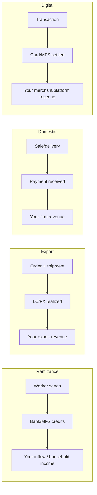
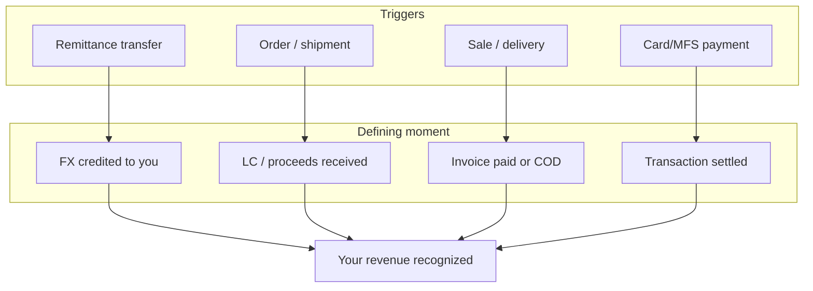

# Bangladesh Revenue Cycle — Tables & Mermaid View

**Scope:** Revenue generation cycle and gestures that define when revenue is generated. Operations from Dhaka; last 6 months (Jul–Dec 2025 / FY2025-26 H1).  
**Focus:** Revenue streams where **you can be the direct beneficiary** (remittance, export, e‑commerce, FDI, domestic business). Government tax (NBR) is excluded — you are not the sole beneficiary of the state.

---

## 1. Revenue sources (scale, last 6 months) — direct-beneficiary flows

| Source                | Approx. scale (H1 FY25-26) | Unit     |
| --------------------- | -------------------------- | -------- |
| Remittance            | 17.17 B                    | USD      |
| RMG exports (Jul–Sep) | 9.97 B                     | USD      |
| E‑commerce card (Aug) | 21.93 cr                   | Tk crore |
| FDI (Jan–Sep)         | 1.41 B                     | USD      |

_Excluded: NBR tax collection (Tk 185,229 cr) — government revenue; no single direct beneficiary._

---

## 2. Defining moments — when is revenue generated? (direct-beneficiary)

| Gesture / moment                                    | Layer           | How revenue is generated                                               |
| --------------------------------------------------- | --------------- | ---------------------------------------------------------------------- |
| Foreign exchange credited to beneficiary (bank/MFS) | Remittance      | Migrant sends; bank/MFS credits taka → your inflow / household income. |
| Export proceeds realized (LC paid / FX received)    | Export          | Order → shipment → LC paid or FX received → your export revenue.       |
| Sale invoiced and paid (or COD delivery)            | Private (Dhaka) | Product/service delivered and paid → your turnover/revenue.            |
| Card/MFS transaction settled                        | Digital         | Payment authorized and settled → your platform/merchant/bank revenue.  |
| Deed signed or advance paid                         | Real estate     | Commitment or payment → your developer/agent revenue.                  |
| FDI / reinvested earnings booked                    | Investment      | Foreign capital or earnings recorded → your firm/country inflow.       |

---

## 3. Mermaid — Revenue generation cycle (direct-beneficiary only)

---

## 4. Mermaid — When is revenue generated? (gesture points, direct-beneficiary)

---

## 5. Main points (cycle + gestures, how) — direct-beneficiary

**Revenue generation cycle (what it is here)**

- **Remittance:** Send → bank/MFS credits **your** account → revenue = your inflow / household income.
- **Export:** Order → produce → ship → LC/FX realized → revenue = **your** export earnings.
- **Domestic (Dhaka):** Sell/deliver → customer pays (cash/COD/card/MFS) → revenue = **your** turnover.
- **Digital:** Transaction → card/MFS settled → revenue = **your** merchant/platform income.

_Not in scope: NBR tax — government revenue; you are not the sole beneficiary._

**Gestures that define “revenue generated” (how)**

1. **Remittance:** FX credited to **you** — the moment the bank/MFS books the credit to your account.
2. **Export:** Proceeds realized — LC paid or FX received by **you** (exporter).
3. **Sale (private):** Invoice paid or COD delivery completed — **you** have the cash.
4. **Digital:** Card/MFS transaction settled — **your** sale is complete.
5. **Real estate:** Deed/registration or advance paid — **you** (developer/agent) receive commitment or cash.
6. **FDI:** Equity or reinvested earnings booked — **your** firm or project receives the inflow.

**Zoom on “how”:** Revenue is generated at the **settlement moment** — when cash or FX moves to **you** and is **recorded** (your bank credit, your export realization, payment against your invoice). The “gesture” is that **recording event** for you; the cycle is trigger → activity → that moment → **your** revenue recognized.

---

## 6. Simple explanations (like you’re 19) — direct-beneficiary only

**Revenue** = money that actually comes in **to you** and gets counted. It’s not “we might get paid” — it’s “the money hit **your** account” or “**your** sale is done.”  
_Government tax (NBR) doesn’t apply as “your” revenue — you’re not the sole beneficiary of the state._

**Revenue sources that can apply to you (what brings in the money)**

- **Remittance:** Money sent to **you** from abroad (e.g. bKash, bank). Counted when it lands in **your** account.
- **RMG / exports:** **You** sell clothes (or other goods) abroad. Revenue = when the buyer pays and **you** get the dollars.
- **E‑commerce / cards:** **You** sell online or take card/MFS. Revenue = when the payment goes through to **you**.
- **FDI / investment:** **Your** firm or project receives foreign capital or reinvested earnings — counted when it’s actually booked.

**Revenue cycle (what actually happens)**

- **Remittance:** Someone sends to **you** → bank/MFS adds it to **your** account → that’s when **you** count it.
- **Export:** Order → **you** make and ship → buyer pays → **you** get dollars → that’s **your** revenue.
- **Domestic (shops, services):** **You** sell something or do a job → customer pays (cash, COD, card) → that’s **your** revenue.
- **Digital:** **You** run the sale → card/MFS settles → that’s **your** revenue.

**“Defining moment” = when we say “your revenue happened”**

- **Remittance:** The second the bank/MFS shows the money in **your** account.
- **Export:** When the buyer’s payment reaches **you** (LC paid / FX received).
- **Sale (shop/service):** When the customer has paid and **you** have the money (or COD: they paid on delivery).
- **Digital:** When the card or MFS transaction to **you** is completed (not pending).
- **Real estate:** When someone pays **you** advance or signs and money reaches **you**.
- **FDI:** When the investment or reinvested earnings are booked to **your** firm.

**One-line takeaway:** **Your** revenue is “counted” at the moment the money actually moves **to you** and gets **recorded** (your bank credit, your export proceeds, payment against your invoice). Before that it’s promise or activity; after that it’s **your** revenue. NBR tax is government revenue — not a direct-beneficiary flow for you.
