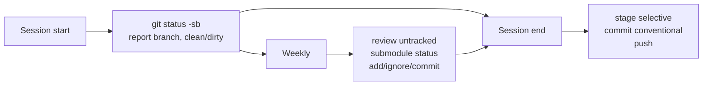

# Git audit guide

Concise reference for what is in git vs not, and when to run the git sequence. See [GIT_REPO.md](GIT_REPO.md) and [SUBMODULES.md](SUBMODULES.md) for full conventions.

## Git vs non-git (characteristic comparison)

| Dimension | Git-covered | Not git-covered |
|-----------|-------------|-----------------|
| **Content** | Source code, shared docs, conventions, Cursor rules/skills/agents, submodule refs | Local hooks, secrets, build artifacts, audit NDJSON, session/debug state, generated or local-only docs |
| **Purpose** | Reproducible project and team context | Machine-local or ephemeral state, security-sensitive data |
| **Examples** | `docs/`, `*.server/`, `shared-types/`, `.cursor/agents/`, `.cursor/skills/`, `.cursor/rules/`, `.gitignore`, `.gitmodules` | `node_modules/`, `.venv/`, `dist/`, `.env*`, `*.ndjson`, `.cursor/hooks.json`, `output/`, `tmp/` |

**Recommendation**: Keep current tracking; add `output/` and `tmp/` to `.gitignore` if they are local-only. Decide policy for root-level `chart.csv`, `metadata.txt`, `snapshot.json` (ignore if generated/local).

## When to run git sequence

- **Session start**: `git status -sb`; optionally `git fetch origin` and `git pull --ff-only`. Report branch and clean/dirty.
- **Session end**: Stage selectively → commit (conventional message) → `git push origin <branch>`.
- **Weekly**: Review untracked files, `git submodule status`, and consider committing or ignoring; see [SUBMODULES.md](SUBMODULES.md) for dirty submodule options.

## Subtractive analysis recommendations (merged)

1. **Root .gitignore**: Include `output/` and `tmp/`; add `chart.csv`, `metadata.txt`, `snapshot.json` if generated/local-only.
2. **Submodules**: `.gitmodules` at repo root with `ignore = dirty` for GRID-main and mcp-tool-experiment; run `git submodule sync` if needed.
3. **projects/web/ai-web-demo**: Either track under the root repo or document as intentional untracked/experimental.
4. **Nested repos**: Keep GRID-main and mcp-tool-experiment as submodules; do not merge into root.
